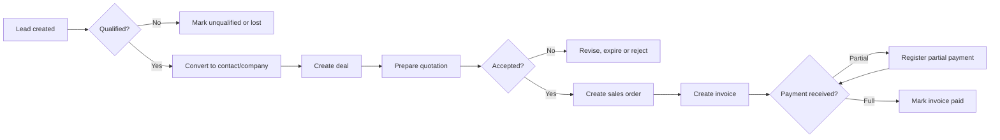
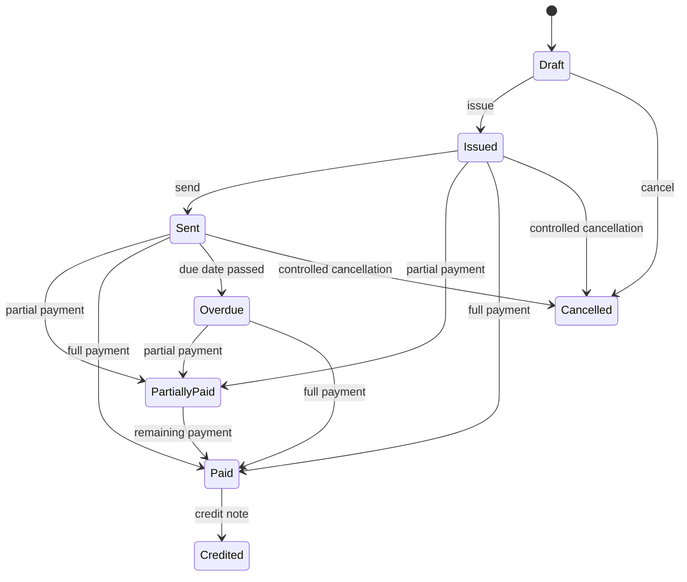
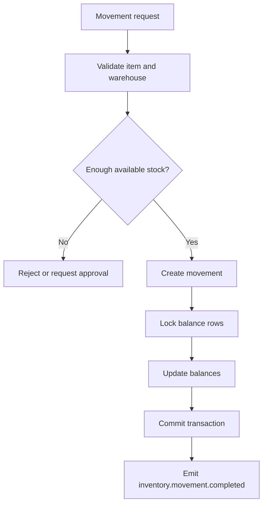
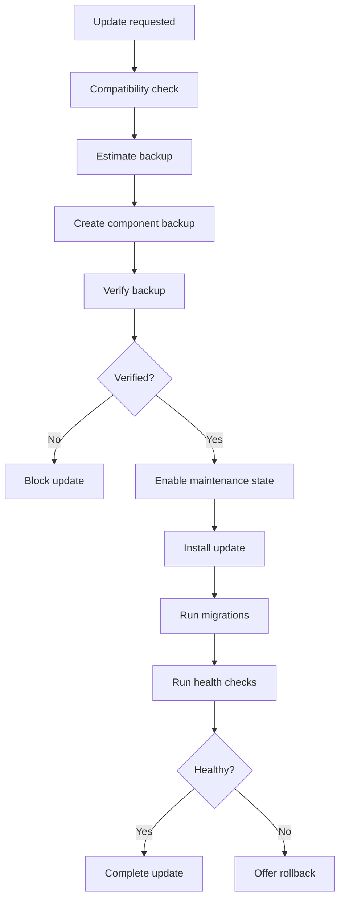
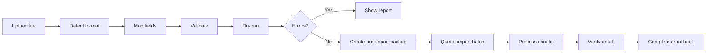

# Kontor Architecture & Engineering Specification

**Document:** `KONTOR-SPECIFICATION.md`  
**Status:** Canonical Draft v1.0  
**Product:** Kontor  
**Positioning:** Open-source modular ERP, CRM and business operations ecosystem for ProcessWire  
**Primary implementation language:** PHP  
**Primary platform:** ProcessWire 3.x  
**Default license:** MIT  
**Primary deployment model:** One ProcessWire installation → one company  
**Extended deployment model:** One installation → multiple organizations  
**Primary UI:** Desktop-first ProcessWire admin interface  
**Supported interface languages at launch:** English, French, German, Spanish  

---

# 1. Purpose of this document

This specification is the single source of truth for the architecture, implementation, extension model and release process of Kontor.

It replaces earlier drafts, conversations and informal design notes where those conflict with this document.

The specification is written for:

- maintainers;
- contributors;
- Codex and other AI development agents;
- third-party component developers;
- reviewers;
- testers;
- integrators;
- organizations deploying Kontor.

The implementation must not invent alternative architecture where this specification already defines one.

---

# 2. Product vision

Kontor is an open-source, modular business operations ecosystem built natively for ProcessWire.

Kontor combines:

- contacts;
- companies;
- CRM;
- products and services;
- quotations;
- orders;
- invoices;
- payments;
- files;
- documents;
- tasks;
- collaboration;
- reports;
- automation;
- inventory;
- purchasing;
- projects;
- API;
- integrations;
- localization;
- optional AI assistance.

Kontor is not a monolithic ERP. It is a platform plus independently versioned components.

The primary product promise is:

> Install only what the business needs, keep full ownership of the data, and extend the system without modifying the core.

---

# 3. Core product principles

## 3.1 Open source

Kontor Core and all official components are free and open source under the MIT License.

The software must permit:

- personal use;
- commercial use;
- modification;
- redistribution;
- private forks;
- white-label deployments;
- custom registries;
- private components;
- offline operation;
- operation without an official cloud service.

## 3.2 ProcessWire-native

Kontor must use:

- ProcessWire users;
- roles;
- permissions;
- module lifecycle;
- admin navigation;
- Inputfields where appropriate;
- Process modules;
- ProcessWire translation system;
- ProcessWire hooks;
- ProcessWire notices;
- ProcessWire admin themes.

Kontor must not replace the ProcessWire admin with an unrelated SPA shell.

## 3.3 Modular

Every major functional area is an independently installable component.

Each component has:

- its own repository;
- its own version;
- its own migrations;
- its own tests;
- its own translations;
- its own changelog;
- its own release lifecycle;
- its own manifest;
- its own backup provider;
- its own import/export providers where applicable;
- its own permissions;
- its own health checks.

## 3.4 Custom-table first

All Kontor business entities are stored in dedicated custom database tables.

ProcessWire Pages are not the primary storage mechanism for business entities.

Pages may be used only for:

- admin process pages;
- optional frontend integration;
- optional relations to site content;
- configuration entities where ProcessWire-native editing provides a clear advantage.

This decision prevents Kontor from forcing business architecture into ProcessWire fields and templates.

## 3.5 Recoverability

No dangerous operation may assume success.

Kontor must provide:

- verified backups;
- pre-update backups;
- import dry runs;
- migration logs;
- rollback paths;
- health checks;
- recovery mode;
- diagnostic bundles;
- disaster recovery documentation.

## 3.6 Stable contracts

Components communicate through:

- public PHP interfaces;
- versioned capabilities;
- events;
- DTOs;
- repositories;
- service contracts;
- registries.

Components must not read or modify another component's database tables directly.

## 3.7 Desktop first

The full interface is designed for desktop.

Tablet support is required.

Mobile support is limited to focused workflows such as:

- search;
- notes;
- tasks;
- approvals;
- barcode scanning;
- quick record viewing;
- document viewing;
- photo upload.

---

# 4. Deployment model

## 4.1 Default deployment

The default model is:

```text
One ProcessWire installation
→ One Kontor instance
→ One company
```

This is the most tested and recommended mode.

## 4.2 Multi-company readiness

All business tables must support an `organization_id`.

Single-company installations use one default organization.

Multi-company mode may be enabled later without database redesign.

Organization isolation applies to:

- contacts;
- companies;
- documents;
- numbering;
- currencies;
- taxes;
- files;
- warehouses;
- reports;
- API tokens;
- exports;
- backups;
- permissions;
- dashboard data.

## 4.3 SaaS guidance

Shared-database multi-tenancy is not the primary architecture.

Recommended SaaS deployment:

```text
One customer
→ One isolated ProcessWire installation
→ One isolated database
→ One Kontor instance
```

---

# 5. Repository architecture

Every official component uses a separate GitHub repository.

## 5.1 Core repositories

```text
mxmsmnv/Kontor
mxmsmnv/KontorSDK
mxmsmnv/KontorDev
mxmsmnv/KontorDocs
```

## 5.2 Business repositories

```text
mxmsmnv/KontorContacts
mxmsmnv/KontorCRM
mxmsmnv/KontorCatalog
mxmsmnv/KontorSales
mxmsmnv/KontorInvoices
mxmsmnv/KontorPayments
mxmsmnv/KontorInventory
mxmsmnv/KontorPurchasing
mxmsmnv/KontorExpenses
mxmsmnv/KontorProjects
mxmsmnv/KontorPortal
mxmsmnv/KontorLedger
```

## 5.3 Platform repositories

```text
mxmsmnv/KontorQueue
mxmsmnv/KontorFiles
mxmsmnv/KontorDocuments
mxmsmnv/KontorSearch
mxmsmnv/KontorDashboard
mxmsmnv/KontorReports
mxmsmnv/KontorAutomation
mxmsmnv/KontorWorkflow
mxmsmnv/KontorRelations
mxmsmnv/KontorCollaboration
mxmsmnv/KontorTasks
mxmsmnv/KontorMail
mxmsmnv/KontorAPI
mxmsmnv/KontorGraphQL
mxmsmnv/KontorCache
mxmsmnv/KontorEntities
mxmsmnv/KontorAI
```

## 5.4 Localization repositories

```text
mxmsmnv/KontorGermany
mxmsmnv/KontorUSA
mxmsmnv/KontorUK
mxmsmnv/KontorFrance
mxmsmnv/KontorSpain
mxmsmnv/KontorSwitzerland
mxmsmnv/KontorCanada
```

## 5.5 Integration repositories

```text
mxmsmnv/KontorStripe
mxmsmnv/KontorPayPal
mxmsmnv/KontorMollie
mxmsmnv/KontorS3
mxmsmnv/KontorR2
mxmsmnv/KontorGoogleDrive
mxmsmnv/KontorGoogleCalendar
mxmsmnv/KontorMicrosoft365
mxmsmnv/KontorSlack
mxmsmnv/KontorTelegram
```

## 5.6 Development meta-repository

`KontorDev` is a development workspace used to test the ecosystem together.

It may contain:

- Docker or local environment helpers;
- Composer path repositories;
- integration test configuration;
- compatibility matrix;
- sample ProcessWire installation;
- end-to-end tests;
- demo datasets;
- release scripts.

It must not become the source repository for component code.

---

# 6. Package names and namespaces

## 6.1 Composer package naming

```text
kontor/core
kontor/sdk
kontor/contacts
kontor/crm
kontor/catalog
kontor/sales
kontor/invoices
kontor/payments
kontor/queue
kontor/files
kontor/documents
kontor/api
```

## 6.2 PHP namespaces

```php
Kontor\Core\...
Kontor\SDK\...
Kontor\Contacts\...
Kontor\CRM\...
Kontor\Catalog\...
Kontor\Sales\...
Kontor\Invoices\...
Kontor\Payments\...
```

## 6.3 ProcessWire module class naming

```text
Kontor
ProcessKontor
KontorContacts
KontorCRM
KontorCatalog
KontorSales
KontorInvoices
KontorPayments
```

There is one main public Process module:

```text
ProcessKontor
```

Business components register routes and admin sections into `ProcessKontor`.

They do not need a separate public Process module unless a component has a justified standalone admin lifecycle.

---

# 7. Standard component directory structure

```text
KontorCRM/
├── KontorCRM.module.php
├── kontor.json
├── composer.json
├── LICENSE
├── README.md
├── CHANGELOG.md
├── src/
│   ├── Admin/
│   ├── Application/
│   ├── Domain/
│   ├── Infrastructure/
│   ├── Contracts/
│   ├── DTO/
│   ├── Events/
│   ├── Listeners/
│   ├── Services/
│   ├── Repositories/
│   ├── Validation/
│   ├── Policies/
│   ├── Providers/
│   └── Support/
├── migrations/
├── resources/
│   ├── views/
│   ├── assets/
│   ├── translations/
│   │   ├── en/
│   │   ├── fr/
│   │   ├── de/
│   │   └── es/
│   ├── templates/
│   └── demo/
├── tests/
│   ├── Unit/
│   ├── Integration/
│   ├── Migration/
│   └── E2E/
└── docs/
```

---

# 8. Architectural layers

Every component follows these layers.

## 8.1 Domain

Contains:

- entities;
- value objects;
- domain services;
- domain events;
- invariants;
- policies;
- state transitions.

The Domain layer must not depend on ProcessWire UI classes.

## 8.2 Application

Contains:

- use cases;
- commands;
- queries;
- orchestration services;
- DTO mapping;
- authorization coordination;
- transaction boundaries.

## 8.3 Infrastructure

Contains:

- SQL repositories;
- ProcessWire adapters;
- cache adapters;
- filesystem adapters;
- queue adapters;
- API adapters;
- external integrations.

## 8.4 Admin

Contains:

- controllers;
- forms;
- tables;
- routes;
- widgets;
- view models.

Admin code must not contain business logic.

---

# 9. Core PHP contracts

The following contracts are canonical.

## 9.1 Component contract

```php
<?php

namespace Kontor\SDK\Contracts;

interface ComponentInterface
{
    public function name(): string;

    public function version(): string;

    public function boot(ComponentContext $context): void;

    public function register(ComponentContext $context): void;

    public function healthChecks(): iterable;
}
```

## 9.2 Capability registry

```php
interface CapabilityRegistryInterface
{
    public function register(
        string $capability,
        string $version,
        string $contract,
        object $implementation,
        string $component
    ): void;

    public function has(string $capability, ?string $constraint = null): bool;

    public function get(string $capability, ?string $constraint = null): object;

    public function all(): array;
}
```

## 9.3 Event dispatcher

```php
interface EventDispatcherInterface
{
    public function dispatch(KontorEvent $event): void;

    public function subscribe(
        string $eventName,
        callable|string $listener,
        int $priority = 0
    ): void;
}
```

## 9.4 Repository contract

```php
interface RepositoryInterface
{
    public function find(string $id): ?object;

    public function require(string $id): object;

    public function save(object $entity): void;

    public function archive(string $id): void;

    public function restore(string $id): void;
}
```

## 9.5 Backup provider

```php
interface BackupProviderInterface
{
    public function component(): string;

    public function estimate(BackupContext $context): BackupEstimate;

    public function export(BackupWriter $writer, BackupContext $context): void;

    public function verify(BackupReader $reader, BackupContext $context): BackupVerification;

    public function restore(BackupReader $reader, RestoreContext $context): RestoreResult;
}
```

## 9.6 Import provider

```php
interface ImportProviderInterface
{
    public function entityType(): string;

    public function fields(): array;

    public function validate(array $record, ImportContext $context): ValidationResult;

    public function findExisting(array $record, ImportContext $context): ?string;

    public function import(array $record, ImportContext $context): ImportRecordResult;
}
```

## 9.7 Export provider

```php
interface ExportProviderInterface
{
    public function entityType(): string;

    public function fields(): array;

    public function filters(): array;

    public function count(array $filters, ExportContext $context): int;

    public function iterate(
        array $filters,
        array $fields,
        ExportContext $context
    ): iterable;
}
```

## 9.8 Search provider

```php
interface SearchProviderInterface
{
    public function name(): string;

    public function supports(string $entityType): bool;

    public function search(SearchQuery $query): SearchResult;
}
```

## 9.9 Report provider

```php
interface ReportProviderInterface
{
    public function key(): string;

    public function title(): string;

    public function schema(): ReportSchema;

    public function execute(ReportQuery $query): ReportResult;
}
```

## 9.10 Queue

```php
interface QueueInterface
{
    public function dispatch(JobInterface $job, ?QueueOptions $options = null): string;

    public function later(
        \DateTimeImmutable $when,
        JobInterface $job,
        ?QueueOptions $options = null
    ): string;

    public function cancel(string $jobId): bool;
}
```

## 9.11 Storage

```php
interface StorageInterface
{
    public function put(string $path, mixed $contents, array $options = []): StoredFile;

    public function read(string $path);

    public function delete(string $path): void;

    public function exists(string $path): bool;

    public function temporaryUrl(string $path, \DateTimeImmutable $expiresAt): string;
}
```

## 9.12 AI provider

```php
interface KontorAIProviderInterface
{
    public function supports(string $capability): bool;

    public function execute(AIRequest $request): AIResponse;
}
```

---

# 10. Database standards

## 10.1 Database engine

Primary support:

- MySQL 8.x;
- MariaDB where compatible.

PostgreSQL may be considered later through an abstraction layer, but is not required for v1.

## 10.2 Table prefix

All tables use:

```text
kontor_
```

Component-owned tables add a component namespace:

```text
kontor_contacts
kontor_crm_deals
kontor_invoices
kontor_inventory_movements
```

## 10.3 Primary keys

Every table uses:

```text
id BIGINT UNSIGNED AUTO_INCREMENT PRIMARY KEY
uid CHAR(26) NOT NULL UNIQUE
```

`uid` is a ULID-like stable identifier.

Public APIs use `uid`, never the numeric `id`.

## 10.4 Common columns

Most business tables include:

```text
organization_id BIGINT UNSIGNED NOT NULL
created_at DATETIME(6) NOT NULL
updated_at DATETIME(6) NOT NULL
created_by BIGINT UNSIGNED NULL
updated_by BIGINT UNSIGNED NULL
version INT UNSIGNED NOT NULL DEFAULT 1
archived_at DATETIME(6) NULL
deleted_at DATETIME(6) NULL
```

## 10.5 Money

Money is stored in minor units:

```text
amount_minor BIGINT NOT NULL
currency_code CHAR(3) NOT NULL
```

Exchange rates use fixed decimal precision:

```text
exchange_rate DECIMAL(20,10)
```

## 10.6 JSON

JSON columns may be used for:

- extension metadata;
- snapshots;
- provider-specific data;
- configuration.

JSON must not replace normalized relational structure for core queryable fields.

## 10.7 Foreign keys

Foreign keys should be used where they do not block modular uninstall and data retention.

Cross-component relationships should prefer stable IDs and relation services over direct foreign keys.

---

# 11. Core database schema

## 11.1 Organizations

```text
kontor_organizations
- id
- uid
- name
- legal_name
- country_code
- default_language
- default_currency
- timezone
- status
- settings_json
- created_at
- updated_at
- version
```

## 11.2 Component state

```text
kontor_components
- id
- name
- version
- status
- source
- checksum
- installed_at
- updated_at
- enabled_at
- disabled_at
- metadata_json
```

## 11.3 Migrations

```text
kontor_migrations
- id
- component
- migration
- checksum
- executed_at
- execution_time_ms
- status
- error_message
```

## 11.4 Audit

```text
kontor_audit_events
- id
- uid
- organization_id
- component
- entity_type
- entity_uid
- action
- actor_type
- actor_uid
- occurred_at
- request_id
- correlation_id
- ip_address
- previous_json
- current_json
- metadata_json
```

## 11.5 Jobs

```text
kontor_jobs
- id
- uid
- queue
- job_type
- payload_json
- priority
- status
- attempts
- max_attempts
- available_at
- started_at
- finished_at
- failed_at
- progress
- idempotency_key
- error_message
- created_at
```

## 11.6 Files

```text
kontor_files
- id
- uid
- organization_id
- storage
- path
- original_name
- mime_type
- size_bytes
- checksum
- visibility
- classification
- entity_type
- entity_uid
- version_number
- metadata_json
- created_at
- created_by
- archived_at
```

## 11.7 Relations

```text
kontor_relations
- id
- uid
- organization_id
- source_type
- source_uid
- target_type
- target_uid
- relation_type
- direction
- metadata_json
- created_at
- created_by
- archived_at
```

## 11.8 Extension metadata

```text
kontor_extensions
- id
- organization_id
- owner_component
- entity_type
- entity_uid
- extension_key
- value_json
- created_at
- updated_at
- UNIQUE(owner_component, entity_type, entity_uid, extension_key)
```

## 11.9 Number sequences

```text
kontor_sequences
- id
- organization_id
- component
- sequence_key
- prefix
- suffix
- next_number
- padding
- reset_policy
- reset_marker
- updated_at
- version
```

---

# 12. Contacts database schema

## 12.1 Contacts

```text
kontor_contacts
- id
- uid
- organization_id
- type
- first_name
- middle_name
- last_name
- display_name
- email
- phone
- mobile
- job_title
- preferred_language
- preferred_currency
- source
- status
- assigned_user_id
- notes
- metadata_json
- created_at
- updated_at
- created_by
- updated_by
- version
- archived_at
- deleted_at
```

Indexes:

```text
INDEX organization_id
INDEX email
INDEX phone
INDEX status
INDEX assigned_user_id
FULLTEXT display_name, email
```

## 12.2 Companies

```text
kontor_companies
- id
- uid
- organization_id
- legal_name
- trading_name
- registration_number
- tax_number
- vat_number
- website
- email
- phone
- preferred_language
- preferred_currency
- payment_terms_days
- credit_limit_minor
- credit_limit_currency
- status
- assigned_user_id
- notes
- metadata_json
- created_at
- updated_at
- version
- archived_at
- deleted_at
```

## 12.3 Addresses

```text
kontor_addresses
- id
- uid
- organization_id
- owner_type
- owner_uid
- address_type
- recipient_name
- company_name
- line1
- line2
- city
- region
- postal_code
- country_code
- is_primary
- metadata_json
- created_at
- updated_at
```

## 12.4 Contact-company memberships

```text
kontor_contact_company
- id
- organization_id
- contact_uid
- company_uid
- role
- department
- is_primary
- started_at
- ended_at
- metadata_json
```

---

# 13. CRM database schema

## 13.1 Leads

```text
kontor_crm_leads
- id
- uid
- organization_id
- title
- contact_uid
- company_uid
- source
- status
- priority
- estimated_value_minor
- currency_code
- assigned_user_id
- next_action_at
- converted_deal_uid
- lost_reason
- description
- created_at
- updated_at
- version
- archived_at
```

## 13.2 Pipelines

```text
kontor_crm_pipelines
- id
- uid
- organization_id
- name
- entity_type
- is_default
- status
- settings_json
```

## 13.3 Pipeline stages

```text
kontor_crm_stages
- id
- uid
- pipeline_uid
- name_key
- display_name_json
- probability
- sort_order
- state_type
- color
- rules_json
```

## 13.4 Deals

```text
kontor_crm_deals
- id
- uid
- organization_id
- pipeline_uid
- stage_uid
- title
- contact_uid
- company_uid
- assigned_user_id
- value_minor
- currency_code
- probability
- expected_close_date
- source
- status
- won_at
- lost_at
- lost_reason
- description
- created_at
- updated_at
- version
- archived_at
```

---

# 14. Catalog database schema

## 14.1 Items

```text
kontor_catalog_items
- id
- uid
- organization_id
- item_type
- sku
- barcode
- title_json
- description_json
- category_uid
- unit_code
- tax_code
- sales_price_minor
- sales_currency
- purchase_price_minor
- purchase_currency
- cost_price_minor
- cost_currency
- track_inventory
- status
- metadata_json
- created_at
- updated_at
- version
- archived_at
```

## 14.2 Price lists

```text
kontor_catalog_price_lists
- id
- uid
- organization_id
- name
- currency_code
- status
- valid_from
- valid_to
```

## 14.3 Price list items

```text
kontor_catalog_prices
- id
- price_list_uid
- item_uid
- price_minor
- currency_code
- min_quantity
- valid_from
- valid_to
```

---

# 15. Sales and invoicing schema

## 15.1 Quotations

```text
kontor_sales_quotations
- id
- uid
- organization_id
- number
- customer_type
- customer_uid
- contact_uid
- deal_uid
- issue_date
- valid_until
- document_language
- currency_code
- subtotal_minor
- discount_minor
- tax_minor
- total_minor
- status
- workflow_state
- template_uid
- snapshot_json
- created_at
- updated_at
- issued_at
- accepted_at
- rejected_at
- version
- archived_at
```

## 15.2 Orders

```text
kontor_sales_orders
- id
- uid
- organization_id
- number
- customer_type
- customer_uid
- contact_uid
- quotation_uid
- issue_date
- expected_delivery_date
- currency_code
- subtotal_minor
- discount_minor
- tax_minor
- shipping_minor
- total_minor
- order_status
- payment_status
- fulfillment_status
- snapshot_json
- created_at
- updated_at
- confirmed_at
- completed_at
- version
- archived_at
```

## 15.3 Invoices

```text
kontor_invoices
- id
- uid
- organization_id
- number
- customer_type
- customer_uid
- contact_uid
- order_uid
- issue_date
- due_date
- document_language
- currency_code
- subtotal_minor
- discount_minor
- tax_minor
- total_minor
- paid_minor
- due_minor
- status
- workflow_state
- template_uid
- snapshot_json
- issued_at
- sent_at
- paid_at
- cancelled_at
- created_at
- updated_at
- version
- archived_at
```

## 15.4 Document lines

```text
kontor_document_lines
- id
- uid
- organization_id
- document_type
- document_uid
- item_uid
- item_type
- sku
- title
- description
- quantity_decimal DECIMAL(20,6)
- unit_code
- unit_price_minor
- currency_code
- discount_type
- discount_value_decimal DECIMAL(20,6)
- tax_code
- tax_rate_decimal DECIMAL(10,6)
- tax_minor
- subtotal_minor
- total_minor
- sort_order
- snapshot_json
```

## 15.5 Payments

```text
kontor_payments
- id
- uid
- organization_id
- number
- payer_type
- payer_uid
- payment_date
- amount_minor
- currency_code
- method
- transaction_reference
- status
- external_id
- metadata_json
- created_at
- updated_at
- version
- archived_at
```

## 15.6 Payment allocations

```text
kontor_payment_allocations
- id
- uid
- organization_id
- payment_uid
- document_type
- document_uid
- amount_minor
- currency_code
- allocated_at
- reversed_at
- metadata_json
```

---

# 16. Inventory schema

## 16.1 Warehouses

```text
kontor_inventory_warehouses
- id
- uid
- organization_id
- code
- name
- address_uid
- manager_user_id
- status
- metadata_json
```

## 16.2 Stock balances

```text
kontor_inventory_balances
- id
- organization_id
- warehouse_uid
- item_uid
- quantity_on_hand DECIMAL(20,6)
- quantity_reserved DECIMAL(20,6)
- quantity_available DECIMAL(20,6)
- updated_at
- version
- UNIQUE(organization_id, warehouse_uid, item_uid)
```

## 16.3 Stock movements

```text
kontor_inventory_movements
- id
- uid
- organization_id
- movement_type
- item_uid
- source_warehouse_uid
- destination_warehouse_uid
- quantity DECIMAL(20,6)
- unit_code
- reference_type
- reference_uid
- reason
- status
- occurred_at
- created_at
- created_by
- idempotency_key
- metadata_json
```

---

# 17. BPMN-style workflows

The first version stores workflow definitions as configuration, while official workflows are documented using Mermaid diagrams.

## 17.1 Lead to payment



## 17.2 Invoice lifecycle



## 17.3 Inventory movement



## 17.4 Backup before update



## 17.5 Import workflow



---

# 18. Workflow engine rules

Official workflows must be configurable through `KontorWorkflow`.

A workflow definition contains:

- workflow key;
- entity type;
- states;
- transitions;
- transition permissions;
- validators;
- required fields;
- approval requirements;
- hooks;
- events;
- immutable states;
- automatic actions.

A component must provide safe default workflows even if `KontorWorkflow` is not installed.

---

# 19. Permission model

Permissions are operation-specific.

## 19.1 Naming

```text
kontor-{component}-{entity}-{action}
```

Examples:

```text
kontor-contacts-contact-view
kontor-contacts-contact-create
kontor-contacts-contact-edit
kontor-contacts-contact-archive
kontor-invoices-invoice-issue
kontor-invoices-invoice-cancel
kontor-payments-payment-create
```

## 19.2 Global permissions

```text
kontor-access
kontor-admin
kontor-settings-view
kontor-settings-edit
kontor-components-view
kontor-components-install
kontor-components-update
kontor-components-disable
kontor-components-remove
kontor-backups-view
kontor-backups-create
kontor-backups-download
kontor-backups-restore
kontor-backups-configure
kontor-import
kontor-import-update
kontor-import-admin
kontor-export
kontor-export-personal-data
kontor-export-financial
kontor-audit-view
kontor-health-view
kontor-diagnostics-download
kontor-updates-bypass-backup
```

## 19.3 Contacts

```text
kontor-contacts-contact-view
kontor-contacts-contact-create
kontor-contacts-contact-edit
kontor-contacts-contact-archive
kontor-contacts-contact-delete
kontor-contacts-company-view
kontor-contacts-company-create
kontor-contacts-company-edit
kontor-contacts-company-archive
kontor-contacts-company-delete
kontor-contacts-merge
kontor-contacts-export
```

## 19.4 CRM

```text
kontor-crm-lead-view
kontor-crm-lead-create
kontor-crm-lead-edit
kontor-crm-lead-convert
kontor-crm-lead-archive
kontor-crm-deal-view
kontor-crm-deal-create
kontor-crm-deal-edit
kontor-crm-deal-move
kontor-crm-deal-close-won
kontor-crm-deal-close-lost
kontor-crm-pipeline-admin
```

## 19.5 Sales

```text
kontor-sales-quotation-view
kontor-sales-quotation-create
kontor-sales-quotation-edit
kontor-sales-quotation-issue
kontor-sales-quotation-send
kontor-sales-quotation-accept
kontor-sales-quotation-cancel
kontor-sales-order-view
kontor-sales-order-create
kontor-sales-order-edit
kontor-sales-order-confirm
kontor-sales-order-complete
kontor-sales-order-cancel
```

## 19.6 Invoices

```text
kontor-invoices-invoice-view
kontor-invoices-invoice-create
kontor-invoices-invoice-edit-draft
kontor-invoices-invoice-issue
kontor-invoices-invoice-send
kontor-invoices-invoice-cancel
kontor-invoices-credit-note-create
kontor-invoices-credit-note-issue
kontor-invoices-numbering-admin
```

## 19.7 Payments

```text
kontor-payments-payment-view
kontor-payments-payment-create
kontor-payments-payment-edit-draft
kontor-payments-payment-allocate
kontor-payments-payment-reverse
kontor-payments-refund-create
```

## 19.8 Inventory

```text
kontor-inventory-stock-view
kontor-inventory-movement-view
kontor-inventory-receive
kontor-inventory-transfer
kontor-inventory-adjust
kontor-inventory-reserve
kontor-inventory-release
kontor-inventory-negative-stock-override
kontor-inventory-warehouse-admin
```

Permission checks are mandatory in:

- admin controllers;
- AJAX endpoints;
- API endpoints;
- CLI commands;
- automation actions;
- background jobs.

---

# 20. API specification

`KontorAPI` exposes REST endpoints under:

```text
/api/kontor/v1/
```

## 20.1 Authentication

Supported methods:

- scoped API token;
- ProcessWire authenticated session where appropriate;
- bearer token;
- future OAuth2 provider.

## 20.2 Standard response

```json
{
  "data": {},
  "meta": {
    "requestId": "req_01...",
    "version": "v1"
  }
}
```

## 20.3 Standard error

```json
{
  "error": {
    "code": "validation_failed",
    "message": "The request contains invalid data.",
    "details": {},
    "requestId": "req_01..."
  }
}
```

## 20.4 Pagination

```text
?page[number]=1
&page[size]=50
```

Response:

```json
{
  "meta": {
    "page": 1,
    "pageSize": 50,
    "total": 1234,
    "totalPages": 25
  }
}
```

## 20.5 Filtering

```text
?filter[status]=paid
?filter[created_from]=2026-01-01
?filter[created_to]=2026-12-31
?filter[customer_uid]=cmp_01...
```

## 20.6 Sorting

```text
?sort=-created_at,number
```

## 20.7 Sparse fields

```text
?fields[invoices]=uid,number,status,total_minor,currency_code
```

## 20.8 Relation expansion

```text
?include=customer,lines,payments
```

## 20.9 Idempotency

Critical create operations accept:

```text
Idempotency-Key
```

## 20.10 Initial endpoints

```text
GET    /contacts
POST   /contacts
GET    /contacts/{uid}
PATCH  /contacts/{uid}
DELETE /contacts/{uid}

GET    /companies
POST   /companies
GET    /companies/{uid}
PATCH  /companies/{uid}

GET    /leads
POST   /leads
POST   /leads/{uid}/convert

GET    /deals
POST   /deals
POST   /deals/{uid}/transition

GET    /products
POST   /products
PATCH  /products/{uid}

GET    /quotations
POST   /quotations
POST   /quotations/{uid}/issue
POST   /quotations/{uid}/convert-to-order

GET    /orders
POST   /orders
POST   /orders/{uid}/confirm

GET    /invoices
POST   /invoices
POST   /invoices/{uid}/issue
POST   /invoices/{uid}/send
POST   /invoices/{uid}/cancel

GET    /payments
POST   /payments
POST   /payments/{uid}/allocate

GET    /inventory/movements
POST   /inventory/movements
```

## 20.11 Webhooks

Webhook event envelopes use the canonical event schema.

Delivery must support:

- signature;
- retries;
- exponential backoff;
- idempotency;
- delivery log;
- disable after repeated permanent failures;
- replay.

---

# 21. Canonical event envelope

```json
{
  "event": "invoice.paid",
  "version": "1.0",
  "eventId": "evt_01...",
  "occurredAt": "2026-07-23T16:20:00Z",
  "organizationId": "org_01...",
  "entityType": "invoice",
  "entityId": "inv_01...",
  "actorType": "user",
  "actorId": "usr_01...",
  "correlationId": "cor_01...",
  "causationId": "evt_00...",
  "data": {}
}
```

---

# 22. Component manifest

Every component contains `kontor.json`.

## 22.1 Canonical example

```json
{
  "$schema": "https://kontor.dev/schema/component.v1.json",
  "schemaVersion": 1,
  "name": "KontorCRM",
  "title": "Kontor CRM",
  "description": "Leads, deals, pipelines and sales activities.",
  "version": "1.0.0",
  "type": "business",
  "category": "crm",
  "license": "MIT",
  "author": {
    "name": "Maxim Semenov",
    "url": "https://github.com/mxmsmnv"
  },
  "repository": "https://github.com/mxmsmnv/KontorCRM",
  "package": "kontor/crm",
  "namespace": "Kontor\\CRM",
  "processWireModule": "KontorCRM",
  "requires": {
    "php": ">=8.2",
    "processwire": ">=3.0.240",
    "kontor/core": "^1.0",
    "kontor/contacts": "^1.0"
  },
  "suggests": {
    "kontor/sales": "^1.0",
    "kontor/reports": "^1.0"
  },
  "conflicts": {},
  "capabilities": [
    {
      "name": "crm",
      "version": "1.0",
      "contract": "Kontor\\CRM\\Contracts\\CRMServiceInterface"
    }
  ],
  "permissions": [
    "kontor-crm-lead-view",
    "kontor-crm-lead-create",
    "kontor-crm-deal-view",
    "kontor-crm-deal-edit"
  ],
  "admin": {
    "sections": [
      {
        "key": "crm",
        "title": "CRM",
        "icon": "handshake-o",
        "order": 200
      }
    ],
    "routes": [
      {
        "path": "crm/leads",
        "controller": "Kontor\\CRM\\Admin\\LeadsController"
      },
      {
        "path": "crm/deals",
        "controller": "Kontor\\CRM\\Admin\\DealsController"
      }
    ]
  },
  "services": [
    "Kontor\\CRM\\Providers\\CRMServiceProvider"
  ],
  "events": {
    "publishes": [
      "crm.lead.created",
      "crm.deal.stage_changed",
      "crm.deal.won",
      "crm.deal.lost"
    ],
    "subscribes": []
  },
  "providers": {
    "backup": "Kontor\\CRM\\Providers\\CRMBackupProvider",
    "import": [
      "Kontor\\CRM\\Providers\\LeadImportProvider",
      "Kontor\\CRM\\Providers\\DealImportProvider"
    ],
    "export": [
      "Kontor\\CRM\\Providers\\LeadExportProvider",
      "Kontor\\CRM\\Providers\\DealExportProvider"
    ],
    "search": [
      "Kontor\\CRM\\Providers\\CRMSearchProvider"
    ],
    "reports": [
      "Kontor\\CRM\\Providers\\PipelineReportProvider"
    ],
    "health": [
      "Kontor\\CRM\\Health\\CRMDatabaseHealthCheck"
    ]
  },
  "translations": {
    "source": "en",
    "languages": ["en", "fr", "de", "es"]
  },
  "migrations": {
    "path": "migrations",
    "supportsRollback": true
  },
  "storage": {
    "tables": [
      "kontor_crm_leads",
      "kontor_crm_pipelines",
      "kontor_crm_stages",
      "kontor_crm_deals"
    ],
    "directories": [
      "site/assets/kontor/crm"
    ]
  },
  "cli": [
    {
      "name": "crm:pipeline:recalculate",
      "handler": "Kontor\\CRM\\CLI\\RecalculatePipelineCommand"
    }
  ],
  "security": {
    "externalConnections": [],
    "sensitiveData": ["lead.email", "deal.value"]
  }
}
```

## 22.2 Manifest requirements

The manifest must declare:

- identity;
- version;
- license;
- package;
- namespace;
- dependencies;
- conflicts;
- capabilities;
- permissions;
- routes;
- services;
- events;
- providers;
- translations;
- migrations;
- owned tables;
- owned directories;
- CLI commands;
- external connections;
- sensitive data.

---

# 23. Localization

Kontor uses the ProcessWire translation system.

Official languages:

- English;
- French;
- German;
- Spanish.

Rules:

- English is source and fallback.
- No user-facing string may be hardcoded.
- PHP uses ProcessWire translation functions.
- JavaScript uses a server-provided translation registry.
- Machine identifiers remain English and stable.
- Documents and email templates support customer language.
- Dates, numbers and currency are locale-aware.
- Translation overrides use ProcessWire-native mechanisms.
- Each component ships its own translation files.
- Stable release requires 100% translation completeness for the four official languages.

---

# 24. Backup requirements

Before updating any component:

1. create component backup;
2. verify backup;
3. mark backup `Verified`;
4. only then continue.

Backups must support:

- full;
- data;
- configuration;
- component;
- pre-update;
- snapshot.

Backups must be exportable to:

- local protected storage;
- download;
- S3-compatible storage;
- Cloudflare R2;
- Backblaze B2;
- Google Drive;
- SFTP.

The system must warn that local-only backup is insufficient.

Recommended rule:

```text
3 copies
2 storage types
1 off-site
```

---

# 25. Import and export

Required export formats:

- XLSX;
- JSON;
- JSONL;
- CSV.

Required import formats:

- XLSX;
- JSON;
- JSONL;
- CSV;
- Kontor ZIP package.

Import must support:

- field mapping;
- preview;
- dry run;
- duplicate detection;
- chunk processing;
- batch ID;
- rollback;
- pre-import backup;
- audit log.

Exports must support:

- machine-readable mode;
- localized human-readable mode;
- selected fields;
- filters;
- saved presets;
- scheduled exports;
- large streaming exports.

---

# 26. Documents

`KontorDocuments` provides:

- document templates;
- visual designer;
- PDF generation;
- HTML preview;
- multilingual templates;
- template versions;
- QR codes;
- barcodes;
- document snapshots;
- immutable issued output;
- custom CSS;
- page breaks;
- conditional sections.

---

# 27. Files

`KontorFiles` provides:

- private storage;
- public storage where explicitly allowed;
- signed downloads;
- metadata;
- classifications;
- checksums;
- versions;
- previews;
- virus scan adapter;
- retention;
- external storage;
- duplicate detection.

---

# 28. Search and command palette

Global shortcut:

```text
Ctrl+K / Command+K
```

Supports:

- entity search;
- settings search;
- components search;
- quick create;
- quick actions;
- admin navigation.

Search backends:

- SQL full-text;
- ProcessWire selector adapter;
- Meilisearch;
- Typesense;
- OpenSearch;
- Elasticsearch.

---

# 29. Dashboard and reports

`KontorDashboard` provides:

- personal dashboards;
- role dashboards;
- organization dashboards;
- drag-and-drop widgets;
- widget permissions;
- configurable refresh;
- cache policies.

`KontorReports` provides:

- report builder;
- filters;
- grouping;
- aggregation;
- calculated fields;
- charts;
- pivot-style reports;
- scheduled reports;
- snapshots;
- Excel/CSV/JSON/PDF export.

---

# 30. Automation

`KontorAutomation` uses:

```text
Trigger
→ Conditions
→ Actions
```

It must provide:

- dry run;
- recursion protection;
- idempotency;
- retries;
- rate limits;
- version history;
- approval gates;
- execution logs.

---

# 31. Queue

`KontorQueue` provides:

- asynchronous jobs;
- delayed jobs;
- retries;
- dead-letter queue;
- priorities;
- progress;
- cancellation;
- locking;
- idempotency;
- recurring jobs;
- CLI worker;
- cron runner.

---

# 32. AI architecture

Kontor AI is optional.

Recommended architecture:

```text
KontorAI
→ business AI contracts
→ Squad adapter
→ provider adapters
```

Kontor must not depend directly on internal Squad implementation details.

Critical AI actions require confirmation unless an explicit approved automation policy allows them.

---

# 33. Privacy and portability

Kontor must support:

- full data export;
- subject access export;
- correction;
- anonymization;
- deletion where legally allowed;
- legal hold;
- retention policies;
- consent metadata;
- audit;
- GDPR-oriented workflows;
- CCPA/CPRA-oriented workflows.

Kontor must not claim automatic legal compliance merely by being installed.

---

# 34. White label

The administrator may change:

- product display name;
- logo;
- favicon;
- accent styling;
- support link;
- documentation link;
- email sender identity;
- portal branding.

Internal identifiers remain unchanged.

---

# 35. CLI

Required command families:

```text
component:*
backup:*
restore:*
import:*
export:*
migration:*
queue:*
search:*
cache:*
demo:*
health:*
diagnostics:*
organization:*
make:*
```

All commands should support:

- JSON output;
- non-interactive mode;
- dry run;
- exit codes;
- audit;
- confirmation flags.

---

# 36. Development stages

The program is divided into stages, substages and milestones.

## Stage 0 — Architecture freeze

### Substage 0.1 — Canonical specification
Milestones:

- approve this document;
- create architecture decision records;
- create glossary;
- create naming conventions;
- create compatibility policy.

### Substage 0.2 — SDK contracts
Milestones:

- implement component contracts;
- implement DTOs;
- implement event envelope;
- implement value objects;
- publish `kontor/sdk` alpha.

### Substage 0.3 — Development environment
Milestones:

- create `KontorDev`;
- configure test ProcessWire;
- configure Composer path repositories;
- configure CI templates;
- configure static analysis;
- configure coding standards.

## Stage 1 — Kontor Core foundation

### Substage 1.1 — Module bootstrap
Milestones:

- `Kontor.module.php`;
- `ProcessKontor.module.php`;
- service container;
- component registry;
- route registry;
- translation registry.

### Substage 1.2 — Core database
Milestones:

- organizations;
- components;
- migrations;
- audit;
- sequences;
- extension metadata;
- relations.

### Substage 1.3 — Component manager
Milestones:

- local discovery;
- ZIP installation;
- dependency checks;
- enable/disable;
- uninstall with data retention;
- registry adapter;
- pre-update backup hook.

### Substage 1.4 — Backup and recovery
Milestones:

- backup provider registry;
- component backup;
- verification;
- local restore;
- recovery mode;
- CLI restore.

### Substage 1.5 — Import and export
Milestones:

- provider registry;
- CSV;
- JSON;
- XLSX;
- dry run;
- batch rollback.

## Stage 2 — Platform infrastructure

### Substage 2.1 — Queue
Milestones:

- job table;
- dispatcher;
- CLI worker;
- retries;
- dead-letter queue;
- progress.

### Substage 2.2 — Files
Milestones:

- local private storage;
- file metadata;
- signed URLs;
- permissions;
- versions;
- external adapter interface.

### Substage 2.3 — Cache
Milestones:

- namespaces;
- tags;
- invalidation;
- ProcessWire adapter;
- Redis adapter contract.

### Substage 2.4 — Search
Milestones:

- provider registry;
- SQL search;
- global search UI;
- command palette;
- indexing queue.

## Stage 3 — Foundational business components

### Substage 3.1 — Contacts
Milestones:

- contacts;
- companies;
- addresses;
- memberships;
- tags;
- duplicate detection;
- import/export;
- permissions;
- translations.

### Substage 3.2 — Catalog
Milestones:

- items;
- products;
- services;
- categories;
- units;
- price lists;
- tax references.

### Substage 3.3 — CRM
Milestones:

- leads;
- pipelines;
- stages;
- deals;
- Kanban;
- conversion;
- reports.

## Stage 4 — Sales and finance-lite

### Substage 4.1 — Sales
Milestones:

- quotations;
- orders;
- document lines;
- conversion;
- status workflows.

### Substage 4.2 — Documents
Milestones:

- templates;
- PDF;
- multilingual output;
- snapshots;
- document designer v1.

### Substage 4.3 — Invoices
Milestones:

- invoices;
- issue workflow;
- numbering;
- overdue state;
- credit notes.

### Substage 4.4 — Payments
Milestones:

- payments;
- allocations;
- partial payments;
- reversals;
- receipts.

## Stage 5 — Collaboration and reporting

### Substage 5.1 — Tasks
Milestones:

- tasks;
- reminders;
- recurrence;
- calendar;
- entity relations.

### Substage 5.2 — Collaboration
Milestones:

- notes;
- comments;
- mentions;
- followers;
- unread states.

### Substage 5.3 — Dashboard
Milestones:

- widget registry;
- layouts;
- personal dashboards;
- role dashboards.

### Substage 5.4 — Reports
Milestones:

- provider registry;
- report builder;
- charts;
- exports;
- scheduled reports.

## Stage 6 — Operations

### Substage 6.1 — Inventory
Milestones:

- warehouses;
- balances;
- movements;
- reservations;
- transfers;
- barcode support.

### Substage 6.2 — Purchasing
Milestones:

- suppliers;
- purchase orders;
- goods receipt;
- inventory integration.

### Substage 6.3 — Expenses
Milestones:

- expenses;
- categories;
- receipts;
- approvals.

### Substage 6.4 — Projects
Milestones:

- projects;
- milestones;
- time tracking;
- billable items;
- invoicing integration.

## Stage 7 — Extensibility

### Substage 7.1 — Workflow
Milestones:

- state machine;
- visual editor;
- transition permissions;
- approvals;
- history.

### Substage 7.2 — Automation
Milestones:

- triggers;
- conditions;
- actions;
- dry run;
- logs;
- recursion protection.

### Substage 7.3 — Custom entities
Milestones:

- entity builder;
- fields;
- relations;
- views;
- permissions;
- API exposure.

### Substage 7.4 — SDK and scaffolding
Milestones:

- `make:component`;
- `make:entity`;
- `make:migration`;
- `make:report`;
- testing helpers;
- documentation.

## Stage 8 — API and external ecosystem

### Substage 8.1 — REST API
Milestones:

- authentication;
- OpenAPI;
- CRUD resources;
- filtering;
- webhooks;
- idempotency.

### Substage 8.2 — GraphQL
Milestones:

- schema registry;
- component types;
- permission enforcement;
- complexity limits.

### Substage 8.3 — Marketplace
Milestones:

- official registry;
- custom registry;
- component metadata;
- advisories;
- publisher model.

## Stage 9 — Advanced capabilities

### Substage 9.1 — Mail
Milestones:

- outbound history;
- inbound adapters;
- entity linking;
- shared mailboxes.

### Substage 9.2 — Portal
Milestones:

- customer login;
- quotations;
- invoices;
- payments;
- files;
- profile.

### Substage 9.3 — AI
Milestones:

- provider contract;
- Squad adapter;
- summaries;
- drafting;
- extraction;
- approval workflow.

### Substage 9.4 — Ledger and localizations
Milestones:

- double-entry foundations;
- chart of accounts;
- localization contracts;
- Germany package;
- country-specific document formats.

---

# 37. Release milestones

## Milestone A — Developer preview

Includes:

- Kontor Core;
- SDK alpha;
- Component Manager local install;
- migrations;
- audit;
- basic backup;
- queue alpha;
- Contacts alpha.

## Milestone B — Internal alpha

Includes:

- Contacts;
- Catalog;
- CRM;
- Search;
- Files;
- import/export;
- English UI complete.

## Milestone C — Public alpha

Includes:

- Sales;
- Documents;
- Invoices;
- Payments;
- French/German/Spanish language packs;
- backup restore;
- CLI.

## Milestone D — Public beta

Includes:

- Dashboard;
- Reports;
- Tasks;
- Collaboration;
- external registry;
- API beta;
- upgrade testing.

## Milestone E — Kontor 1.0

Requires:

- stable Core contracts;
- stable database schema policy;
- verified backup/restore;
- clean install;
- upgrade from beta;
- translations at 100%;
- documentation;
- demo data;
- security review;
- end-to-end workflow tests;
- disaster recovery test.

---

# 38. Definition of Done

A feature is complete only if it includes:

- business logic;
- service layer;
- repository;
- permission checks;
- audit;
- events;
- validation;
- transactions where required;
- idempotency where required;
- translations in English, French, German and Spanish;
- backup support if data is owned;
- import/export support if portable;
- health check;
- unit tests;
- integration tests;
- migration tests;
- UI test;
- documentation;
- changelog;
- upgrade path;
- uninstall behavior.

---

# 39. Codex rules

Codex must not:

1. store business entities as ProcessWire Pages unless this specification explicitly allows it;
2. place business logic in Process controllers;
3. access another component's tables directly;
4. use numeric IDs in public APIs;
5. use PHP float for money;
6. mutate issued financial documents;
7. skip permission checks in AJAX, API, CLI or queue jobs;
8. hardcode user-facing strings;
9. update components without verified backup;
10. remove user data during ordinary uninstall;
11. write secrets to logs, exports or diagnostics;
12. introduce hidden required dependencies;
13. create breaking schema changes without migrations;
14. bypass event contracts;
15. create one-off caching systems outside Kontor Cache contracts;
16. implement automation without recursion and idempotency protection;
17. create exports without access checks;
18. create destructive operations without preview, audit and recovery strategy.

---

# 40. Final architectural decision

Kontor is a platform, not a monolith.

The canonical model is:

```text
Kontor Core
→ stable contracts
→ independent components
→ custom tables
→ one ProcessKontor admin shell
→ verified backups
→ full import/export
→ native ProcessWire localization
→ open-source ecosystem
```

The implementation should begin only after this specification is accepted as the working architectural baseline.
